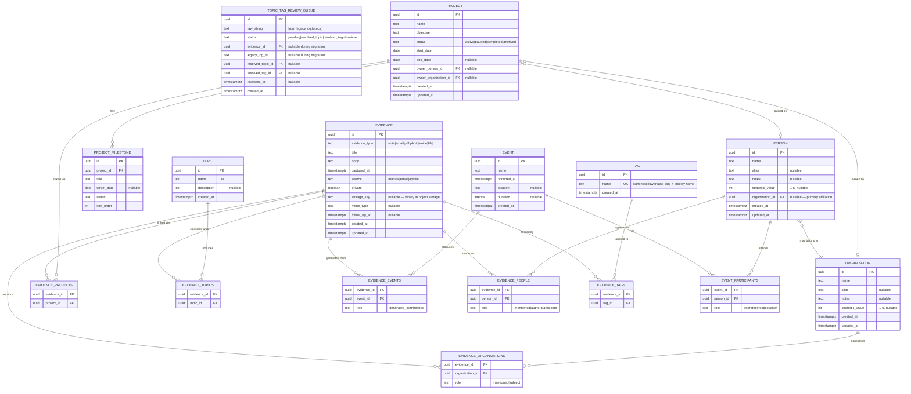

# ARGUS Knowledge Model Refactor v01

**Status:** Canonical design brief — **schema locked** (2026-07-04). Phase 1 DDL draft for review.

**AI rule of construction:** [`ai-charter.md`](ai-charter.md) — facts before opinions; evidence before conclusions.

**Objective:** Refactor the current data model into a single, consistent knowledge architecture that behaves like a graph, not a folder hierarchy.

---

## Design principles

1. Every concept has exactly one responsibility.
2. Every piece of information exists only once.
3. Relationships create organization — not duplication.
4. Metadata never replaces domain objects.
5. The model must support future graph queries.

---

## Core ontology

| Entity | Responsibility | Never |
|--------|----------------|-------|
| **Evidence** | Stored artifact (note, email, file, photo, document, …); editable in v01 | Owns or duplicates domain objects |
| **Project** | Temporary work with objective and lifecycle | Owns Evidence |
| **Topic** | Permanent knowledge domain | Contains copies of Evidence |
| **Event** | Something that happened at a point in time | Stores note body (generates Evidence instead) |
| **Person** | A human | Be a tag or topic |
| **Organization** | A company, institution, team | Be a tag or topic |
| **Tag** | Lightweight workflow/filter metadata | Be knowledge or a category |

### Tags vs Topics

| | Topic | Tag |
|---|-------|-----|
| Lifespan | Permanent | Removable without changing meaning |
| Question answered | “What is this about?” | “How do I process this?” |
| Examples | Trading, SQL, Psychology | urgent, draft, review, waiting |

---

## Entity Relationship Diagram (ERD)

Agree on this schema before writing migration code.

### Relationship rules (from brief)

| From | Relationship | To |
|------|--------------|-----|
| Evidence | may reference | Project, Topic, Event, Person, Organization, Tag |
| Project | relates to | Evidence (junction only) |
| Topic | relates to | Evidence (junction only) |
| Event | generates | Evidence |
| Person | participates in | Event |
| Organization | contains | Person |

**No arrays on Evidence or domain tables for relationships.** All many-to-many via junction tables.

---

## UI invariant

The same Evidence row appears in every view through joins — never copied:

- Project → Matrix → `evidence_projects`
- Topic → Trading → `evidence_topics`
- Person → John → `evidence_people`
- Event → Weekly Review → `evidence_events`
- Tag → urgent → `evidence_tags`

### Project page (v01 initial cutover)

Shows **only** Evidence directly linked via `argus_evidence_projects`. Smart filters (people, tags, date range) are deferred.

---

## Current model → target mapping

Today (`lib/argus/types.ts`, JSON + partial Supabase inbox):

| Current | Target | Migration note |
|---------|--------|----------------|
| `Log` | `evidence` where `evidence_type = note` (or mapped type) | Body/title/date/source migrate; `kind` split out |
| `InboxItem` | `evidence` where `evidence_type = email` | Stop parallel inbox→log conversion path; inbox becomes Evidence |
| `Attachment` | `evidence` row or `evidence.storage_key` | Binary stays in object storage; parent polymorphism removed |
| `Entity` type `project` | `projects` | Add objective, status, owner FKs; drop `linkedPersonIds` / `linkedTags` from project |
| `Entity` type `person` | `people` | `strategicValue`, alias, notes migrate |
| `Entity` type `company` | `organizations` | Same |
| `Entity` type `other` + `Kind: Topic` in notes | `topics` | Promote from notes hack to first-class table |
| `Log.topics[]` strings | **Manual review queue** | One queue row per string; human resolves to Topic or Tag |
| `Log.kind = event` | `events` + `evidence_events` | Event is domain object; meeting notes are Evidence |
| `Log.kind = follow_up` | `evidence.follow_up_at` | Not a domain entity — datetime on Evidence |
| `project.linkedPersonIds` | Remove from project | Use `evidence_people` + optional `project.owner_person_id` |
| `project.linkedTags` | Remove from project | Tags attach to Evidence only |
| `log.entityIds[]` polymorphic | Junction tables by type | Resolve each ID to person/org/project at migration time |
| `reference-types.ts` place | **Deferred** | Optional free-text on `events.location` only |
| `reference-types.ts` document | `evidence` where `evidence_type = document` | Not a separate domain table |

---

## Overlap conflicts to resolve (before migration)

### 1. Topics stored three ways today

- `log.topics[]` (strings)
- `Entity` type `other` with `Kind: Topic` in notes
- Project `linkedTags[]` (misnamed — treated as tags but used like topic filters)

**Decision:** Topics become `topics` table only. Legacy strings enter the review queue first. Project page (initial) uses `evidence_projects` direct links only.

### 2. Events vs journal `kind`

`Log.kind = event` mixes chronology (Event) with content (Evidence).

**Decision:** Event row holds when/where/who; notes/photos from that meeting are Evidence linked via `evidence_events`.

### 3. Tags vs Topics on the same field

`log.topics` holds both "Trading" (Topic) and potentially "urgent" (Tag).

**Decision (locked):** Manual review queue only. Each legacy `log.topics[]` string becomes a row in `argus_topic_tag_review_queue`. No automatic Topic/Tag split.

### 4. Inbox vs Evidence

Inbox is a staging area today; converted items duplicate into Log.

**Decision:** Email intake creates Evidence directly (`evidence_type = email`). Status (`pending`, `archived`) becomes Tag or a non-domain `intake_status` column on Evidence — not a separate entity.

### 5. Generic `Entity` table

Single table with `type` enum and notes-encoded subtypes violates principle 1.

**Decision:** Drop generic Entity in v01. Each domain type gets its own table.

---

## Storage recommendation

| Layer | Technology | Scope |
|-------|------------|-------|
| Relational core | Supabase Postgres | All entities + junction tables |
| Binaries | Supabase Storage (`argus-files`) | Evidence payloads |
| Dev fallback | JSON file | Read-only during transition; deprecate |

Replace `text[]` arrays in `argus_inbox_items` (`linked_entity_ids`, `attachment_ids`) with junction tables in the v01 schema.

---

## Success criteria (from brief)

- [ ] Every note exists exactly once (`evidence` table).
- [ ] Projects never own notes (junction only).
- [ ] Topics never duplicate notes (junction only).
- [ ] Events organize chronology (separate from Evidence body).
- [ ] Tags only filter (on Evidence; removable).
- [ ] All navigation through relationships.
- [ ] Semantic search can be added without schema redesign.

---

## Schema lock decisions (2026-07-04)

| # | Decision |
|---|----------|
| 1 | Evidence **body is editable** in v01. Use `created_at` + `updated_at`. Defer append-only revision model. |
| 2 | Follow-ups use **`follow_up_at`** on Evidence. Not a Tag. |
| 3 | **Place deferred.** Document = Evidence type (`evidence_type = document`). |
| 4 | Legacy `log.topics[]` → **manual review queue** (`argus_topic_tag_review_queue`). No auto-classify. |
| 5 | Project page (initial): **direct `evidence_projects` links only.** Smart filters later. |

**Out of scope for Phase 1:** UI, migration scripts, product behavior changes, smart filters, AI/OCR/automation.

**Phase 1 deliverable:** `supabase/argus-v01-schema.sql` (DDL draft for review only).

---

## Migration phases

| Phase | Scope | Status |
|-------|-------|--------|
| **0 — Schema agreement** | ERD + lock decisions | ✅ Done |
| **1 — Postgres DDL** | Create tables + junctions; no app change | 🔄 Draft for review |
| **2 — Evidence unification** | Merge Log + InboxItem → Evidence; dual-write | Pending |
| **3 — Entity split** | Migrate Entity blob → typed tables | Pending |
| **4 — Topic/Tag review** | Enqueue `log.topics[]`; human resolves queue | Pending |
| **5 — Event extraction** | Promote `kind=event` logs to Event rows | Pending |
| **6 — UI cutover** | Views query joins; project page = direct links only | Pending |
| **7 — Deprecate JSON** | Remove `ARGUS_DATA_DIR` local store | Pending |

---

## Deferred (not blocking v01 DDL)

- **Private Evidence:** `private boolean` column on Evidence (not a Tag).
- **Topic merge policy:** Canonical name rules at review time, not in DDL.
- **Append-only revisions:** `supersedes_evidence_id` — post-v01.
- **Place entity:** v01.1+.

---

## References

- Current types: `lib/argus/types.ts`
- Current reference hack: `lib/argus/reference-types.ts`
- Inbox (partial cloud, pre-v01): `supabase/argus-inbox.sql`
- **v01 DDL draft:** `supabase/argus-v01-schema.sql`
- Phase 1 gate (pre-refactor checklist): `md/argus/phase-1-gate.md`
