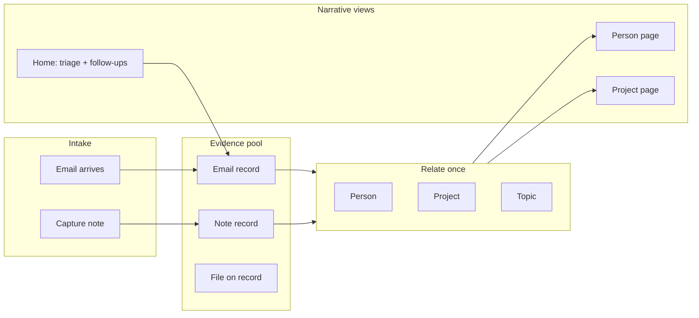

# ARGUS Product Flow Proposal

**Date:** 2026-07-04  
**Scope:** Flow reset proposal only — no schema changes, no new features, no code in this pass.  
**Canonical lens:** Evidence → Relations → Narrative views ([`knowledge-model-v01.md`](knowledge-model-v01.md))  
**Product pain:** *“Reconstruct a professional story I can defend.”*

---

## 1. Product thesis

ARGUS should help a professional answer, quickly and credibly:

> *What happened with [Person / Project / Topic]? Show me the evidence.*

That is a **narrative reconstruction** problem — not a filing problem. The user needs one chronological, linkable trail of notes, emails, and files they can stand behind in a meeting, email, or review.

**Success = one path to all evidence for a subject in under 30 seconds.**

**Focus test:** *Can the user find all evidence for Earl in 30 seconds?*

---

## 2. Mental model (no schema change)

Map the **existing v3 storage** onto the canonical lens without migrating tables:

| Canonical | Today (v3) | User-facing label |
|-----------|------------|-------------------|
| **Evidence** | `Log` (notes, events, follow-ups) + `InboxItem` (email) + attachments on either | “Evidence” / “Record” |
| **Relations → Person** | `log.entityIds` or `inbox.linkedEntityIds` containing person/company entity | “Linked people” |
| **Relations → Project** | Same arrays, project entity id | “Linked project” |
| **Relations → Topic** | `log.topics[]` strings **or** topic entity in `entityIds` / `linkedEntityIds` | “Topics” |
| **Narrative view** | Person page, Project page, chronological list | “Story” / “Evidence trail” |

**Rule for this proposal:** Stop treating Inbox and Journal as separate products. Treat them as **one evidence pool** with two shapes (note vs email).

---

## 3. Current UI flow audit

### 3.1 Entry points

| Route | Role today | Alignment |
|-------|------------|-----------|
| `/argus/journal` | Home — 6 sections, capture FAB | ⚠️ Too many sections; evidence scattered |
| `/argus/inbox` | Pending email list | ⚠️ Siloed from person/project story |
| `/argus/network` | People/org index + intelligence cards | ⚠️ No unified evidence; logs only on detail |
| `/argus/network/[id]` | Person/org detail | ⚠️ Logs only; **misses linked inbox emails** |
| `/argus/projects/[id]` | Project metadata + edit form | ❌ **No evidence list** |
| `/argus/logs/[id]` | Single note edit | ✅ Good evidence detail |
| `/argus/inbox/[id]` | Email viewer + triage | ⚠️ Convert duplicates evidence |
| `/argus/search` | Entity name + note text search | ⚠️ **No inbox search**; no “all evidence for X” |

### 3.2 Home screen (`JournalHome`)

Six sections in nav:

| Section | Source | Useful for story? | Issue |
|---------|--------|---------------------|-------|
| **Activity** | Recent logs | Partial | Duplicates inbox/documents; not person-centric |
| **Follow-ups** | Logs with follow-up dates | ✅ Yes | Action-oriented; keep |
| **Inbox** | Pending `InboxItem` | ✅ Yes | Correct triage surface; keep |
| **Projects** | Project entities + link counts | Partial | Opens edit page, not evidence |
| **Network** | Top network cards | Low on home | Redundant with Search/Network tab |
| **Documents** | Logs with attachments | Partial | Subset of evidence; overlaps Activity |

**Default section:** Inbox (good for triage, bad for “find Earl”).

### 3.3 Inbox triage flow

Current actions on pending email:

1. **Assign project** → `linkInboxToEntities` (project id in `linkedEntityIds`)
2. **Link contact** → same (person/company id)
3. **Create follow-up** → `convertInboxToLog` → **creates a second Log**; inbox marked `converted`
4. Archive / delete / open full viewer

**Pain:** Email linked to Earl stays in Inbox until converted. Person page (`getEntityHistory`) reads **logs only** — linked inbox emails **never appear** on Earl’s story.

**Pain:** “Create follow-up” implies duplication. User must choose between *inbox email* and *journal note* for the same fact.

### 3.4 Capture flow

- FAB → `CaptureSheet` → creates `Log` with `entityIds` + `topics`
- Can create Person / Project / Topic references inline
- Works as **note evidence** + relations in one step ✅

### 3.5 Project page

Shows: dates, linked people/tags counts, edit form, delete.  
**Missing:** Any list of linked logs or inbox items.  
Home “linked count” includes logs + inbox — project page does not.

### 3.6 Person page (`network/[id]`)

Shows: intelligence scores, topics derived from logs, **recent activity = logs only (max 12)**.  
**Missing:** Inbox emails where `linkedEntityIds` includes this person.  
**Missing:** Attachment/file evidence not surfaced distinctly.  
**Missing:** Prominent search-within-person or “view all evidence.”

### 3.7 Search

- Entities by name → links to network page
- Notes by title/body/topics text
- **Does not search:** inbox subject/body/from, attachment names, unconverted emails

### 3.8 Focus test: “Find all evidence for Earl” today

| Step | Action | Time | Result |
|------|--------|------|--------|
| 1 | Search “Earl” | ~5s | Finds person entity ✅ |
| 2 | Open person page | ~3s | See logs mentioning Earl ✅ |
| 3 | Look for emails | — | **Not shown** if only linked on inbox ❌ |
| 4 | Check inbox manually | ~15s+ | User must remember Earl had pending mail ❌ |
| 5 | Check project pages | ~10s+ | Indirect; no Earl-centric view ❌ |

**Verdict:** **Fails 30-second test** unless every email was converted to a log (duplicate path).

---

## 4. Target flow (Evidence → Relations → Narrative)

**User story (Earl):**

1. Email arrives → appears in Home **Inbox**.
2. User links **Earl** (Person) + **Matrix** (Project) + **Trading** (Topic) — **no convert required**.
3. User archives when done → email leaves triage queue but **stays on Earl’s evidence trail**.
4. User opens **Earl** → one chronological list: notes + emails + files.
5. User opens **Matrix** project → same evidence filtered by project link.

---

## 5. Smallest implementation plan

Constraints: **no schema change**, **no new features** (reuse existing fields and actions), **no UI redesign** (reorder, rewire, relabel only).

### Phase A — Unified evidence helper (read layer)

**What:** One server helper that returns a sorted “evidence list” for an entity id:

- Logs where `entityIds` includes id
- Inbox items where `linkedEntityIds` includes id and `status !== archived` (or include archived on person page — see decision below)
- Normalize to a common DTO: `{ kind: 'note' | 'email', date, title, preview, href, attachmentIds }`

**Files touched (later):** `lib/argus/evidence-views.ts` (new), consumed by pages only.

**Schema:** None.

---

### Phase B — Inbox item *is* evidence (stop forcing convert)

**What:** Change triage semantics without new tables:

| Today | Proposed |
|-------|----------|
| Link contact/project | **Keep** — this *is* relating evidence |
| “Create follow-up” (convert) | **Rename/replace** with “Add note” that creates a log **without** requiring convert; optional separate action |
| Convert copies body to Log | **Demote**: convert becomes optional “duplicate as note” (advanced), not default path |
| Classified = converted log | **Classified = linkedEntityIds.length > 0** (already partially true via `linked` status) |
| Archive removes from triage | **Keep** — archive = triage complete, evidence remains linkable |

**Minimal behavior change:**

1. After link Person + Project + Topic, allow **Archive** as the primary “done” action.
2. Person/Project pages include **linked inbox items** via Phase A helper.
3. Change copy: “Create follow-up” → “Add related note” (only when user needs a separate note).

**Schema:** None — uses `linkedEntityIds`, `status`, existing link/archive actions.

**Topic on inbox:** Today inbox has no `topics[]`. **Without schema:** link Topic entity (existing `Entity` type `other` + `Kind: Topic`) via `linkedEntityIds`, *or* add topics only when user adds a related note. Document both; prefer linking topic entity in picker (zero schema).

---

### Phase C — Project page shows linked evidence

**What:** Add one section below edit form:

- Heading: **Evidence** (or “Linked records”)
- List from Phase A helper filtered to project id
- Each row links to `/argus/logs/[id]` or `/argus/inbox/[id]`
- Empty state: “No evidence linked yet. Link records from Inbox or Capture.”

**Schema:** None — reads `log.entityIds` + `inbox.linkedEntityIds`.

**Scope control:** Direct links only (matches v01 decision). No date-range or people inference.

---

### Phase D — Person page shows linked evidence

**What:** Replace “Recent activity (logs only, 12)” with **Evidence** section:

- Full unified list via Phase A (notes + emails), sorted by date desc
- Show at least 20 items or paginate simply (“View all” if >20)
- Include **archived** inbox items on person page (story must be complete)
- Optional: subsection labels “Email” / “Note” badges (existing card patterns)

**Also fix:** Home inbox linked entities link to `network/[id]` even for projects — should link to `/argus/projects/[id]` when type is project.

**Schema:** None.

---

### Phase E — Relate evidence to Person, Project, Topic (single pattern)

**What:** Align existing surfaces to one relation pattern:

| Surface | Person | Project | Topic |
|---------|--------|---------|-------|
| Capture / edit log | `entityIds` | `entityIds` | `topics[]` or topic entity in `entityIds` |
| Inbox triage | `linkedEntityIds` | `linkedEntityIds` | topic entity via `linkedEntityIds` |
| Activity edit | already supports all | already supports all | already supports `topics` |

**Minimal addition:** Inbox picker adds **Topic** mode (third button or unified “Relate” picker filtering person / project / topic entities + topic strings from tag buckets on optional “Add note” sheet only).

**Without schema for topic strings on inbox:** Use topic **entity** in `linkedEntityIds` for email↔topic relation.

**Schema:** None.

---

### Phase F — Home: only useful live sections

**What:** Reduce Home nav from 6 → **4** sections:

| Keep | Why |
|------|-----|
| **Inbox** | Triage incoming evidence |
| **Follow-ups** | Action queue — “what needs a response” |
| **People** | Rename from “Network” — jump to a person’s story |
| **Projects** | Jump to project evidence (after Phase C) |

| Remove from Home nav | Why |
|----------------------|-----|
| **Activity** | Generic stream; fails person-centric story test |
| **Documents** | Subset of evidence; lives on Person/Project pages |

**Default landing section:** **Inbox** if pending > 0, else **Follow-ups** if any, else **People**.

**Bottom nav:** Unchanged (Home, Networking, Inbox, Search) — home sections are not extra routes.

**Schema:** None — `JournalHome.tsx` section list only.

---

## 6. Implementation sequence (smallest safe order)

| Step | Deliverable | User-visible win | Depends on |
|------|-------------|------------------|------------|
| **1** | Phase A — evidence list helper | — (internal) | — |
| **2** | Phase D — Person page unified evidence | **Earl test passes** | Step 1 |
| **3** | Phase C — Project page evidence list | Project story defensible | Step 1 |
| **4** | Phase B — Inbox triage copy + archive-first flow | Stop duplicate convert pressure | Steps 2–3 visible |
| **5** | Phase E — Topic on inbox link picker | Topic in email story | Step 4 |
| **6** | Phase F — Home section trim | Less noise | Steps 2–3 |

**Do not start:** search rewrite, timeline page, topic routes, smart filters, schema migration.

---

## 7. Focus test acceptance criteria

**Scenario:** Earl is a Person entity. User has 2 notes and 1 email linked to Earl; email is archived.

| # | Criterion | Pass when |
|---|-----------|-----------|
| 1 | Search “Earl” → open person | ≤10s |
| 2 | Person page shows **both notes and email** | All 3 visible |
| 3 | Email opens from person page | One tap to `/argus/inbox/[id]` or unified detail |
| 4 | No manual inbox hunt | User never opens Inbox tab for this test |
| 5 | Chronological order | Newest first; dates visible |

**Total target:** ≤30 seconds from Home to reading any Earl evidence item.

---

## 8. Copy changes (zero schema)

| Current | Proposed |
|---------|----------|
| “Create follow-up” (inbox) | “Add related note” |
| “Recent activity” (person) | “Evidence” |
| “Notes” (search section) | “Evidence” |
| “Networking” (home section) | “People” |
| “Linked to” (inbox) | “Related to” |
| “Convert” / “converted” status | De-emphasize; prefer “Linked” + “Archived” |

---

## 9. Explicit non-goals (this proposal)

- Postgres v01 migration or new tables
- Topic timeline route or global search overhaul
- Smart project filters (people/tags/date inference)
- Event entity extraction
- AI, OCR, automation
- Visual redesign — reuse `LogCard`, inbox cards, existing layout shells

---

## 10. Risks and mitigations

| Risk | Mitigation |
|------|------------|
| Archived inbox hidden from home but needed on person page | Person helper **includes archived**; home inbox stays pending-only |
| Topic as string vs entity inconsistent | Inbox uses topic **entity** in `linkedEntityIds`; notes keep `topics[]` until v01 migration |
| Convert still creates duplicates | Demote to secondary action; document as “copy email into new note” |
| Project `linkedPersonIds` confuses story | Out of scope — project page shows **direct evidence links only**, not inferred via people |

---

## 11. Approval gate

Proceed to implementation only when:

- [ ] Earl 30-second test criteria accepted
- [ ] Home reduced to 4 sections agreed
- [ ] Archive-first inbox triage agreed over convert-first
- [ ] Person page includes archived linked emails agreed

**Stop here.** No code until this proposal is approved.
