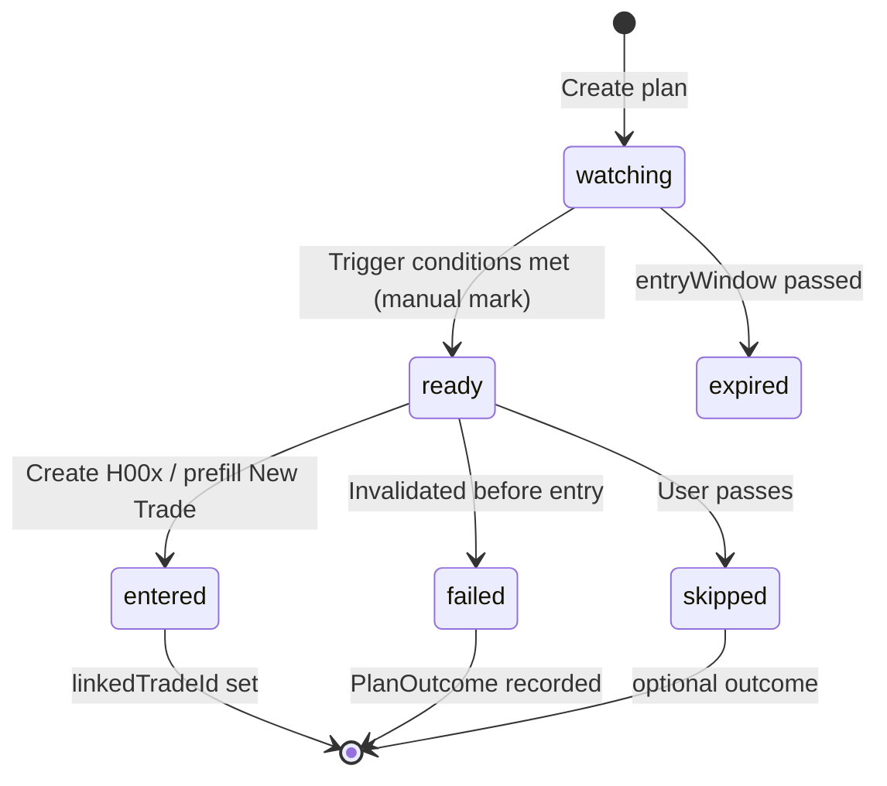

# Planning module — proposal (Phase 0)

**Status:** Phase 0 **shipped** (2026-07-09). Scouting Desk MVP + Stock File links (2026-07-10). **UI name:** Scouting Desk (route `/planning`). Phase 1+ → `md/concepts/deferred-matrixtrade.md` and §7 below.
**Owner intent:** Pre-trade workspace to scout entries, save plans, and follow what failed — before creating H00x trades.

---

## 1. What we understood

You want a **dedicated Planning area** (not the same as Playbook Lab or New Trade):

| Need | Meaning |
|------|---------|
| **Acciones posibles** | Tickers under consideration — not yet committed as H00x |
| **Plan de entrada** | Saved entry level, support, stop, target, R:R |
| **Multi-timeframe (MTF)** | Analyze strategy on higher frames; **enter on the smallest** frame |
| **Seguimiento** | Track *when* to enter (watching → ready → entered / skipped) |
| **Fallos con contexto** | When a plan fails, record *why* — was the strategy sound but execution/timing/news killed it? |

This is **planning**, not logging closed trades. ChatGPT will help flesh out rules later; MatrixTrade only needs **structure + partial logic** now.

---

## 2. How it fits MatrixTrade today

```
Strategy Playbook  →  HOW to trade (rules, checklist, stats)     [/playbook — unchanged]
Stock File         →  WHO is this ticker (profile, zones)       [links via stockThesisId]
Scouting Desk      →  go / wait / no + tactical scouts          [/planning]
New Trade          →  EXECUTE (H00x, shares, inbox proposal)
Journal / Review   →  AFTER close (lessons, mistakes)
```

Scouting Desk sits **between** Stock File and New Trade. Scouts may link both `playbookId` (strategy) and `stockThesisId` (stock file).

---

## 3. Proposed route & shell

| Item | Proposal |
|------|----------|
| **Route** | `/planning` under `(preview)` + `PreviewShell` |
| **Nav label** | **Planning** (Trading section, after Playbook) |
| **Phase 0 UI** | Dark list + detail drawer — no charts API yet |

Classic `/trades/new` stays dormant; planning does **not** replace it.

---

## 4. Core entities (minimal data model)

### `TradePlan` (new — `data/plans.json` or Supabase later)

| Field | Type | Purpose |
|-------|------|---------|
| `id` | string | e.g. `PLAN-001` |
| `ticker` | string | AAPL, MSFT… |
| `playbookId` | string? | Link to Strategy Playbook (HOW) |
| `stockThesisId` | string? | Link to Stock Thesis (WHAT) — Phase 0 shipped |
| `status` | enum | `watching` · `ready` · `entered` · `skipped` · `failed` · `expired` |
| `analysisTimeframes` | string[] | Frames used to **validate** thesis (subset of catalog below) |
| `entryTimeframe` | string | **Smallest** frame for trigger (must be in catalog) |
| `plannedEntry` | number? | Intended entry price |
| `supportLevel` | number? | Key support for invalidation |
| `stopPrice` | number? | Planned stop |
| `targetPrice` | number? | Planned target |
| `plannedRR` | number? | Risk:reward (e.g. 2.5) |
| `entryWindow` | object? | `validFrom` / `validUntil` — estimated window to act |
| `thesis` | string? | Why this setup now |
| `chatNotes` | string? | Paste from Assistant — not auto-applied |
| `linkedTradeId` | string? | H00x when plan becomes a trade |
| `createdAt` | ISO | |
| `updatedAt` | ISO | |

### `PlanOutcome` (when status → `failed` or `skipped`)

| Field | Purpose |
|-------|---------|
| `failedAt` | When plan was abandoned |
| `reason` | `no_trigger` · `stopped_early` · `news` · `slippage` · `discipline` · `other` |
| `strategyStillValid` | boolean — user judgment: setup was right, execution/context failed |
| `externalFactors` | string[] | e.g. `earnings`, `gap`, `low_volume` |
| `lesson` | short text — feeds Journal mindset later |

---

## 5. Timeframe catalog (fixed list — Phase 0)

Higher → context. Lower → entry trigger.

| Tier | Values | Role |
|------|--------|------|
| **Macro** | `6M`, `3M` | Trend / regime |
| **Swing** | `1W`, `1D` | Structure, support/resistance zones |
| **Intraday** | `1H`, `30m`, `15m` | Setup formation |
| **Trigger** | `5m` | **Default smallest entry frame** |

**Rule (partial logic, Phase 0):**

```
entryTimeframe must be the smallest frame selected in analysisTimeframes
validation: entryTimeframe ∈ {5m, 15m, 30m, 1H, 1D, 1W, 3M, 6M}
warn if entryTimeframe is not the minimum of analysisTimeframes
```

No auto-TA in Phase 0 — user picks frames and levels manually. Chat develops scan rules later.

---

## 6. Status flow (following / cuándo entrar)



**Phase 0:** all transitions are **manual buttons** — no market data feed.

---

## 7. Phase 0 scope (build small)

### In scope

- [x] Route `/planning` + nav item
- [x] CRUD plans (create, edit status, archive via status)
- [x] Form: ticker, playbook, timeframes, entry/stop/target/support, R:R, window dates
- [x] List filters: `watching` | `ready` | `failed` | `expired` | needs review
- [x] Failed/expired plan capture: `strategyStillValid` + `externalFactors` + lesson
- [x] Auto-expire when `validUntil` passes (on read)
- [x] Dashboard attention + tiles for active plans and plans to evaluate
- [x] AI snapshot section `=== TRADE PLANS (AI) ===`
- [x] Link **Enter** → `/trades-preview` with query prefill

### Out of scope (Chat / later)

- Live quotes, auto support detection
- Alert when price hits `plannedEntry`
- Full MTF charting
- Auto-promote plan → inbox proposal

---

## 8. UI sketch (preview dark)

**List view**

| Ticker | Playbook | Entry TF | Status | R:R | Window |
|--------|----------|----------|--------|-----|--------|
| NVDA | Breakout v2 | 5m | ready | 2.4 | Jul 9–11 |

**Detail panel**

- Analysis frames: `1D, 1H, 15m, 5m` (chips)
- Entry frame: `5m` (highlighted)
- Levels: support / entry / stop / target
- Thesis + Chat notes (readonly paste area)
- Actions: Mark ready · Enter trade · Mark failed · Skip

**Failed follow-up modal**

- ¿La estrategia seguía válida? sí/no
- Factores externos (checkboxes)
- Lección breve

---

## 9. Relation to risk rules

Planning does **not** consume monthly cap or H00x slots until **entered**.

When user clicks **Enter** → same gates as `createTrade` (monthly allowance, per-ticker -250, max trades).

---

## 10. Assistant / Chat workflow (future)

1. User discusses setup in `/exchange`
2. Chat outputs structured block (future: `MT-PLAN:v1`)
3. User saves to Planning — **human approves**, never auto-apply
4. Plan sits in `watching` until user marks `ready`

Phase 0: manual form only; block format documented in Phase 1.

---

## 11. Resolved decisions

1. **ID format** — `PLAN-001` auto-increment
2. **Expired plans** — auto-expire on `validUntil` when status is `watching` or `ready`
3. **Failed/expired on Dashboard** — yes, in Needs attention + KPI tiles

## 12. Changelog

| Date | Change |
|------|--------|
| 2026-07-10 | Planning Lab rename + `stockThesisId` linking, thesis R:R validation |
| 2026-07-09 | Phase 0 implemented — UI, storage, auto-expire, dashboard, AI snapshot |
| 2026-07-09 | Initial proposal — Phase 0 scope, MTF rule, status flow, failure tracking |
