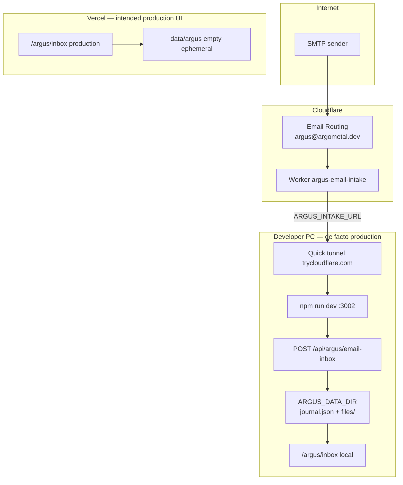

# ARGUS Cloud-First Audit — Email Intake

**Date:** 2026-07-03  
**Status:** Phase 0 — audit only (no implementation)  
**Finding:** Email pipeline works; storage routing is wrong for production.

---

## Executive finding

The email path is **technically correct** end-to-end, but **production storage is the developer’s PC**.

| Layer | Intended (cloud-first) | Actual (today) |
|-------|------------------------|----------------|
| Email entry | Cloudflare Email Routing | ✅ Cloudflare Email Routing |
| Integration | Cloudflare Worker | ✅ `argus-email-intake` |
| API target | Vercel production URL | ❌ Quick tunnel → `localhost:3002` |
| Persistence | Supabase (+ R2 for files) | ❌ `ARGUS_DATA_DIR` on local disk |
| UI read path | Vercel `/argus/inbox` | ❌ Reads same store as API write (local only) |

This is the **same drift** as MatrixTrade before `TRADES_STORE=supabase`: the cloud app exists, but the source of truth stayed local.

---

## 1. Current data flow

### Exact path today

```text
Internet (SMTP)
    ↓
argus@argometal.dev
    ↓
Cloudflare Email Routing (argometal.dev MX)
    ↓
Worker: argus-email-intake
    │  postal-mime → JSON payload
    │  Authorization: Bearer $ARGUS_INBOX_TOKEN
    ↓
POST $ARGUS_INTAKE_URL
    = https://investigated-used-develops-sight.trycloudflare.com/api/argus/email-inbox
    ↓
cloudflared quick tunnel
    ↓
http://localhost:3002/api/argus/email-inbox   (Next.js dev server)
    ↓
lib/argus/server-storage.ts
    │  createInboxItem() → journal.json
    │  saveAttachment()  → files/{id}
    ↓
ARGUS_DATA_DIR = C:\Users\vmartinez9\ArgusData   (local PC)
    ├── journal.json      (entities, logs, inboxItems, attachments metadata)
    └── files/{id}        (binary blobs)
    ↓
UI: http://localhost:3002/argus/inbox
    reads getInboxItems() → same journal.json
```

### Parallel path (disconnected)

```text
https://matrix-trade-theta.vercel.app/argus/inbox
    ↓
app/argus/(app)/inbox/page.tsx
    ↓
getInboxItems() → server-storage → journal.json
    ↓
ARGUS_DATA_DIR="" on Vercel → fallback {cwd}/data/argus/
    ↓
Empty / ephemeral / not shared with Worker or local PC
```

### Diagram



### Where each piece points

| Question | Answer |
|----------|--------|
| Where does the Worker POST today? | Quick tunnel URL → local dev server |
| `ARGUS_INTAKE_URL` | `https://….trycloudflare.com/api/argus/email-inbox` |
| Which API receives it? | `app/api/argus/email-inbox/route.ts` on **local** Next.js |
| Which storage? | `lib/argus/server-storage.ts` → filesystem under `ARGUS_DATA_DIR` |
| Which UI shows emails? | Local `/argus/inbox` only; Vercel inbox is empty |

**Verified:** Real emails from `argometal@hotmail.com` → `argus@argometal.dev` returned **201** and landed in `C:\Users\vmartinez9\ArgusData\journal.json` (e.g. inbox items `1783070733786-9eym2fr`, attachment `Image.jpeg` 736 KB).

---

## 2. Source of truth

### Current source of truth

| Store | Role | Cloud-visible? |
|-------|------|----------------|
| **`ARGUS_DATA_DIR/journal.json`** | **Authoritative** — all entities, logs, inbox items, attachment metadata | ❌ No |
| **`ARGUS_DATA_DIR/files/`** | Binary attachment bytes | ❌ No |
| Supabase | Trades + playbooks only (`TRADES_STORE=supabase`) | ✅ Yes (MatrixTrade) |
| `data/argus/` (repo fallback) | Legacy when `ARGUS_DATA_DIR` unset | Gitignored; empty on Vercel |

There is **no `ARGUS_STORE` switch**. Unlike MatrixTrade’s `lib/trades-store/` (json | supabase), ARGUS has a **single backend**: `server-storage.ts` + Node `fs`.

### Why Vercel cannot see incoming emails

Three independent blockers:

1. **Worker destination is local** — `ARGUS_INTAKE_URL` targets a quick tunnel, not `https://matrix-trade-theta.vercel.app/api/argus/email-inbox`. Vercel never receives the POST.

2. **Even if the Worker posted to Vercel**, Vercel serverless has **no persistent disk**. Writes go to the function filesystem (ephemeral). Each invocation / cold start does not share state with the UI or the next email.

3. **Vercel env is not configured for ARGUS intake** — `.env.vercel.production` shows `ARGUS_DATA_DIR=""`, no `ARGUS_INBOX_TOKEN`, no Supabase-backed ARGUS store. Production ARGUS UI reads an empty `journal.json`.

**Net:** Local PC became production storage because the only working intake path terminates on `localhost:3002` + `C:\Users\vmartinez9\ArgusData`.

---

## 3. Cloud-first target

### Unified Argometal platform (recommended)

One stack for MatrixTrade, ARGUS, and future apps:

| Layer | Service | Role |
|-------|---------|------|
| Applications | **Vercel** | UI + API routes (Next.js) |
| Structured data | **Supabase** | Postgres — trades, playbooks, ARGUS journal/inbox/entities |
| Binary files | **Cloudflare R2** | Attachments, exports, large evidence |
| Integrations | **Cloudflare Workers** | Email bridge, AI, webhooks, future automations |
| Email ingress | **Cloudflare Email Routing** | `*@argometal.dev` → Workers |

MatrixTrade already uses Vercel + Supabase for trades. ARGUS should follow the same pattern instead of a second architecture.

### Target email flow

```text
Internet
    ↓
argus@argometal.dev
    ↓
Cloudflare Email Routing
    ↓
Worker: argus-email-intake          (unchanged code)
    ↓
POST https://matrix-trade-theta.vercel.app/api/argus/email-inbox
    ↓
Vercel API route                    (unchanged route handler signature)
    ↓
server-storage → Supabase adapter   (new internals)
    ↓
Supabase (inbox_items, attachments metadata, …)
    +
R2 (attachment bytes)
    ↓
Vercel UI /argus/inbox              (unchanged pages — same server-storage API)
```

### Environment split

| Environment | Storage | Worker `ARGUS_INTAKE_URL` |
|-------------|---------|---------------------------|
| **Production** | Supabase + R2 | Vercel production URL |
| **Local dev** | Supabase dev project (or json fallback) | `localhost` or dev tunnel (optional) |

Local machine = **development only**. No tunnel required for production email.

---

## 4. Required changes (filesystem assumptions)

Do **not** redesign UI. These files/modules assume **local filesystem** today:

### Storage core (must abstract)

| File | Assumption |
|------|------------|
| `lib/argus/server-storage.ts` | All CRUD via `fs.readFile` / `fs.writeFile` on `journal.json` and `files/` |
| `lib/argus/storage/paths.ts` | `ARGUS_DATA_DIR`, `journalFile`, `filesDir` |
| `lib/argus/storage/bootstrap.ts` | Creates dirs, migrates repo → `ARGUS_DATA_DIR` |
| `lib/argus/migrate.ts` | Reads/parses local `journal.json` |
| `lib/argus/storage/index.ts` | Re-exports path helpers |

### API routes (call server-storage — stable surface)

| File | Role |
|------|------|
| `app/api/argus/email-inbox/route.ts` | Email intake POST → `createInboxItem`, `saveAttachment` |
| `app/api/argus/inbox/route.ts` | Generic inbox POST |
| `app/api/argus/files/[id]/route.ts` | Serves attachment bytes from disk |

### UI + actions (read via server-storage — no change if API stable)

| File |
|------|
| `app/argus/actions.ts` |
| `app/argus/(app)/inbox/page.tsx` |
| `app/argus/(app)/inbox/[id]/page.tsx` |
| `app/argus/(app)/journal/page.tsx` |
| `app/argus/(app)/logs/[id]/page.tsx` |
| `app/argus/(app)/network/page.tsx` |
| `app/argus/(app)/network/[id]/page.tsx` |
| `app/argus/(app)/search/page.tsx` |

### Email parsing (no storage — keep)

| File |
|------|
| `lib/argus/email-inbox.ts` |
| `lib/argus/inbox-api-auth.ts` |

### Configuration / docs / tools

| File | Notes |
|------|-------|
| `.env.local` / `.env.local.example` | `ARGUS_DATA_DIR`, `ARGUS_INBOX_TOKEN` |
| `.env.vercel.production` | Missing ARGUS intake vars |
| Worker secrets | `ARGUS_INTAKE_URL`, `ARGUS_INBOX_TOKEN` |
| `tools/deploy-argus-email-worker.ts` | Reads token from `.env.local` |
| `tools/test-email-inbox.ts`, `simulate-email-worker-intake.ts` | Local test helpers |
| `md/integrations/argus-storage.md` | Documents filesystem model |

### Worker (no code change in Phase 4 — secret only)

| File |
|------|
| `argus-email-bridge/src/index.ts` |
| `argus-email-bridge/wrangler.toml` |

### MatrixTrade pattern to mirror

| Existing (trades) | Needed (ARGUS) |
|-------------------|----------------|
| `lib/trades-store/types.ts` | `lib/argus-store/types.ts` |
| `lib/trades-store/json.ts` | `lib/argus-store/json.ts` (wrap current fs logic) |
| `lib/trades-store/supabase.ts` | `lib/argus-store/supabase.ts` |
| `TRADES_STORE=json\|supabase` | `ARGUS_STORE=json\|supabase` |
| `supabase/schema.sql` (trades) | `supabase/argus-schema.sql` (new tables) |

---

## 5. Minimum migration

**Goal:** Email to `argus@argometal.dev` appears on `https://matrix-trade-theta.vercel.app/argus/inbox` with **no local server**.

**Constraints honored:** No UI redesign. No Worker code change. No ARGUS data model change (same `InboxItem`, `Attachment`, `Log`, `Entity` shapes).

### Minimum work list

1. **Supabase schema** — tables mirroring `journal.json` slices:
   - `argus_inbox_items`
   - `argus_logs`
   - `argus_entities`
   - `argus_attachments` (metadata + `storage_key` for R2 or storage path)

2. **Storage adapter** — extract current `server-storage.ts` fs logic into `argus-store/json`; add `argus-store/supabase`; `server-storage.ts` delegates by `ARGUS_STORE` (same public functions as today).

3. **Attachment bytes** — Phase 3 minimum for email with attachments:
   - Upload bytes in `saveAttachment()` to R2 (or Supabase Storage)
   - `readAttachmentBytes()` fetches from object store
   - `GET /api/argus/files/[id]` streams from cloud

4. **Vercel production env**
   - `ARGUS_STORE=supabase`
   - `SUPABASE_URL`, `SUPABASE_SERVICE_ROLE_KEY` (shared with MatrixTrade project)
   - `ARGUS_INBOX_TOKEN` (same value as Worker secret)
   - `ARGUS_PASSWORD` (already needed for production auth)
   - R2 credentials / bucket binding vars for attachment routes

5. **Worker secret only** (no Worker redeploy of logic):
   - `ARGUS_INTAKE_URL=https://matrix-trade-theta.vercel.app/api/argus/email-inbox`

6. **One-time seed** — copy existing `C:\Users\vmartinez9\ArgusData\journal.json` + files into Supabase/R2 so production UI is not empty.

7. **Stop quick tunnel for production** — tunnel becomes dev-only optional.

### What stays unchanged

- All `app/argus/**` pages and components
- `app/api/argus/email-inbox/route.ts` handler logic (parse → createInboxItem → saveAttachment)
- Worker MIME → JSON contract
- Cloudflare Email Routing rule

---

## 6. Attachments

### Current behavior

- Metadata in `journal.json` → `attachments[]`
- Bytes in `{ARGUS_DATA_DIR}/files/{attachmentId}` (opaque filename, no extension)
- Served via `GET /api/argus/files/[id]`

Email intake sends **base64 in JSON** from Worker (proven up to ~736 KB JPEG).

### Recommendation

| | **Cloudflare R2** (preferred) | **Supabase Storage** |
|---|------------------------------|----------------------|
| **Fits platform** | Same vendor as Email Routing + Workers | Same vendor as structured data |
| **Worker future** | Worker could upload directly to R2 (skip Vercel body size) | Worker would need Supabase service key |
| **Vercel API path** | Server receives base64 → PUT to R2 | Server receives base64 → Supabase Storage upload |
| **Cost / egress** | Low egress; S3-compatible | Included in Supabase tier; egress rules apply |
| **Evidence / legal hold** | Bucket policies, lifecycle, versioning | Bucket + RLS policies |
| **Complexity** | One extra binding (account-wide bucket `argometal-files`) | Simpler if avoiding R2 setup |
| **MatrixTrade alignment** | Unified “files on Cloudflare” for all Argometal apps | All-in-Supabase |

**Preferred:** Metadata in **Supabase** (`argus_attachments.storage_key`, `mime_type`, `size`, `parent_id`), binaries in **R2** (`argus/inbox/{id}` or `{attachmentId}`).

**Acceptable minimum:** Supabase Storage only — faster to ship, migrate to R2 later if Worker direct-upload is needed.

---

## 7. Phases

### Phase 0 — Audit ✅ (this document)

- Document drift: email works, storage local
- Confirm Worker → tunnel → local API → `ARGUS_DATA_DIR`
- Confirm Vercel disconnected

### Phase 1 — Storage abstraction

- Add `lib/argus-store/` with `json` adapter (move fs code from `server-storage.ts`)
- Add `ARGUS_STORE` env (`json` default — no behavior change locally)
- `server-storage.ts` becomes thin facade (like `lib/trades-json.ts` → `trades-store`)
- Validate: all existing ARGUS UI + tests pass unchanged on `json`

### Phase 2 — Supabase structured data

- Add `supabase/argus-schema.sql` (inbox, logs, entities, attachment metadata)
- Implement `argus-store/supabase.ts`
- Seed tool: `tools/seed-argus-supabase.ts` from local `journal.json`
- Vercel: `ARGUS_STORE=supabase` + Supabase env vars
- Validate: `/argus/inbox` on Vercel shows seeded items (no email yet)

### Phase 3 — Attachment storage

- R2 bucket + server-side upload in `saveAttachment` / download in `readAttachmentBytes`
- Migrate existing `files/*` blobs to R2
- Validate: email with attachment on Vercel — file downloadable via `/api/argus/files/[id]`

### Phase 4 — Switch Worker destination

- Update Worker secret `ARGUS_INTAKE_URL` → Vercel production URL
- Set `ARGUS_INBOX_TOKEN` on Vercel (match Worker)
- Send test email → appears on Vercel `/argus/inbox` without local dev server
- **Do not change Worker code**

### Phase 5 — Remove local production dependency

- Document: quick tunnel = dev only
- Local dev uses Supabase dev/staging project (or explicit `ARGUS_STORE=json` for offline)
- Decommission `C:\Users\vmartinez9\ArgusData` as production truth
- Optional: named Cloudflare Tunnel for local dev intake testing only

---

## Appendix — MatrixTrade vs ARGUS today

| | MatrixTrade | ARGUS |
|---|-------------|-------|
| Cloud UI | Vercel ✅ | Vercel (empty data) |
| Store switch | `TRADES_STORE` ✅ | None ❌ |
| Supabase | trades, playbooks ✅ | Not implemented ❌ |
| Worker integration | Bridge snapshot | Email intake → **local** |
| Production truth | Supabase (when configured) | **Local PC disk** |

---

## Related

- [`supabase-cloud-first.md`](supabase-cloud-first.md) — MatrixTrade migration pattern
- [`argus-storage.md`](argus-storage.md) — current filesystem model
- [`argus-email-routing-final.md`](argus-email-routing-final.md) — email routing (working)
- [`vercel-argus-production-handoff.md`](vercel-argus-production-handoff.md) — prior Vercel gap analysis
