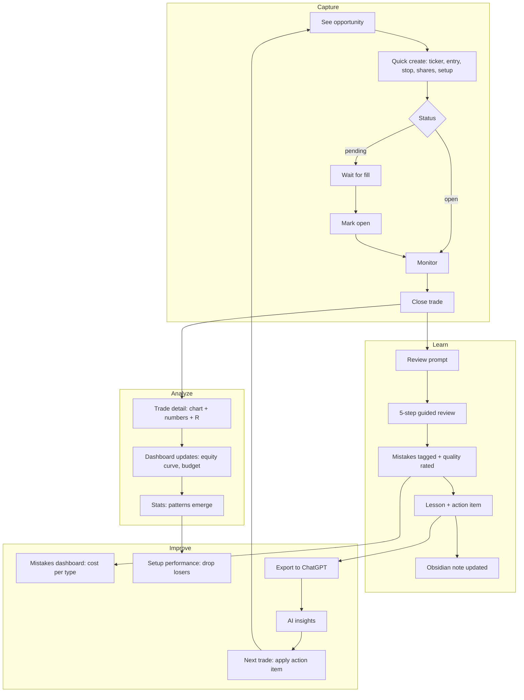

# Matrix Trading — UX Design Proposal

**Status:** Design only — no implementation  
**Date:** 2026-07-02  
**Scope:** MatrixTrade app (`/`, `/trades`, `/connect`)  
**Out of scope:** ARGUS, Journal, Network, Inbox, code changes, refactors

---

## North star

Matrix Trading must improve **real trading decisions**, not become a form-filling app.

Every screen answers one question in the workflow:

```text
Capture  →  Analyze  →  Learn  →  Improve
```

Matrix already owns **numbers** (entry, stop, exit, P/L, cycle rules). Obsidian owns **qualitative depth** (thesis, psychology, lessons). This design keeps that split and makes the handoff between them frictionless.

**Design principle:** Default to action, not data entry. Show what matters now; hide the rest until review time.

---

## 1. Comparación corta de las mejores apps

| App | Fortaleza principal | Patrón UX clave | Debilidad / riesgo para Matrix |
|-----|---------------------|-----------------|--------------------------------|
| **TraderSync** | Dashboard modular, 40+ métricas, chart-first en trade detail | Widgets configurables + tabla de trades filtrable | Sobrecarga visual; desktop-heavy; muchos campos opcionales |
| **Edgewonk** | Behavioral analytics, mistake cost, setup checklists | Tiltmeter, report cards, session reviews estructuradas | UI densa; onboarding pesado; muchos tags custom |
| **Tradervue** | Reports limpios, MFE/MAE, charts con entry/exit | Drill-down por tag显示 → filtro → trade | Social/mentoring no aplica; muchas integraciones broker |
| **TradesViz** | 600+ stats, AI Q&A, simulador | Preguntas en lenguaje natural sobre tus datos | Feature bloat; análisis sin acción; abruma al usuario |
| **Journalytix** | Capture inmediato post-trade, playbooks | Journal Queue, voice dictation, session P&L live | Solo futures/NinjaTrader; caro; no aplica a swing investing |
| **Portfolio Performance** | Equity curve como artefacto central | Curva + markers de trades + drawdown underwater | Orientado a portfolio long-term, no experiment cycles |
| **TradingView** | Chart-centric, multi-timeframe, anotaciones | Una pantalla = un chart con contexto mínimo | No es journal; no trackea mistakes ni review |
| **Koyfin** | Dashboards custom, progressive disclosure | Widget grid personalizable, drillBusiness data | Market data platform, no trade review workflow |
| **Finviz** | Mapa del mercado en un vance | Treemap sectorial, color = performance | Solo breadth; cero profundidad de proceso |

### Posicionamiento de Matrix

Matrix no compite con Finviz/Koyfin (market data) ni con ARGUS (knowledge journal). Compite en el espacio **Edgewonk + Tradervue + Journalytix capture**, pero para un ciclo experimental acotado (H001–H030) con Obsidian como memoria cualitativa.

```text
                    Profundidad analítica
                           ▲
                           │
         TradesViz ●        │        ● TraderSync
                           │
         Tradervue ●       │    ● Edgewonk
                           │
              Matrix ●─────┼──────────────────► Accionabilidad
                           │              (mejorar decisiones)
         Journalytix ●     │
                           │
         Portfolio Perf ●  │
                           │
         Finviz/Koyfin ●   │
                           ▼
                    Amplitud de mercado
```

Matrix debe vivir en el cuadrante **accionable + suficiente profundidad**, no en el de máxima amplitud.

---

## 2. Patrones UX que Matrix debe copiar

### Capture (registrar sin fricción)

| Patrón | Fuente | Aplicación en Matrix |
|--------|--------|----------------------|
| **Quick capture post-cierre** | Journalytix Journal Queue | Al cerrar trade → prompt de 30 segundos, no formulario completo |
| **Defaults inteligentes** | Tradervue auto-import | Pre-fill ticker, entry, stop desde último pending; solo confirmar |
| **Voice / paste friendly** | Journalytix | Botón "Paste from ChatGPT" para importar review (MT-IMPORT:v1 futuro) |
| **Status-driven UI** | Matrix actual | pending → open → closed muestra acciones distintas, no campos estáticos |

### Analyze (entender qué pasó)

| Patrón | Fuente | Aplicación en Matrix |
|--------|--------|----------------------|
| **Chart con entry/exit markers** | Tradervue, TradingView | Trade detail muestra chart primero, números después |
| **R-multiple y risk/reward** | TraderSync, Edgewonk | Métrica derivada automática; no campo manual |
| **MFE/MAE simplificado** | Tradervue | "Best possible exit" vs "Worst during trade" — solo si hay datos |
| **Filtro → drill-down** | Tradervue, TraderSync | Stats page: click en "losing trades" → lista filtrada → trade detail |
| **Progressive disclosure** | Koyfin | Dashboard muestra 4 KPIs; stats completas en `/stats` |

### Learn (extraer lecciones)

| Patrón | Fuente | Aplicación en Matrix |
|--------|--------|----------------------|
| **Mistake tags con costo** | Edgewonk | "FOMO" tag → cuánto costó en $ acumulado |
| **Setup checklists** | Edgewonk | Playbook checklist pre-trade; post-trade marca cumplimiento |
| **Report card periódico** | Edgewonk | Weekly review card: wins, losses, top mistake, action item |
| **Trade quality rating** | Edgewonk Trade Comments | 1–5 en entry, exit, management — 3 taps, no essay |
| **Obsidian deep link prominente** | Matrix actual | "Open analysis" siempre visible, no enterrado |

### Improve (cerrar el loop)

| Patrón | Fuente | Aplicación en Matrix |
|--------|--------|----------------------|
| **Action items concretos** | Edgewonk Sessions | Review termina con 1–3 acciones para próxima sesión |
| **Rule violation alerts** | Edgewonk Tiltmeter | Visual cuando trade rompe reglas del ciclo (stop too wide, etc.) |
| **Equity curve con trade markers** | Portfolio Performance | Ver qué trades empujaron la curva arriba/abajo |
| **AI snapshot handoff** | Matrix actual + TradesViz Q&A | Export estructurado para ChatGPT con pregunta sugerida |
| **Cycle budget visibility** | Matrix actual | Remaining loss budget siempre visible — behavioral anchor |

---

## 3. Patrones que Matrix NO debe copiar

| Patrón | Fuente | Por qué NO |
|--------|--------|------------|
| **40+ widgets configurables** | TraderSync | Decision paralysis; Matrix tiene 30 trades max, no necesita dashboard infinito |
| **600+ statistics** | TradesViz | Análisis sin acción; viola "mejorar decisiones reales" |
| **Custom tags ilimitados (20+)** | Edgewonk | Tag sprawl; Matrix usa setup + 5–7 mistake types fijos |
| **Social feed / leaderboards** | Journalytix, Kinfo | Privado por diseño; no aplica |
| **Broker auto-sync / 80+ integrations** | Tradervue, TraderSync | Experiment cycle es manual y deliberado |
| **Backtesting / simulador integrado** | TradesViz, Edgewonk | Fuera de scope; ChatGPT puede simular con context export |
| **Market screener / treemap** | Finviz, Koyfin | ARGUS/market tools son otro producto |
| **Formulario de 20 campos al crear trade** | Muchos journals | Viola "no app de llenar formularios" |
| **Duplicar Journal/Network de ARGUS** | ARGUS | Trading aislado; auth compartido solo |
| **AI automático en cada trade** | Plancana, TradesViz | Matrix: AI on-demand via export, no auto-calls |
| **Mobile-first dense UI** | ARGUS | Matrix es desktop-first para review; mobile = capture rápido |
| **PDF reports para stakeholders** | TraderSync | Uso personal; export text es suficiente |

### Anti-patterns específicos para Matrix

1. **Empty form syndrome** — Pantalla de "New trade" con 15 campos vacíos.
2. **Stats without story** — Gráfico de win rate sin link a trades concretos.
3. **Qualitative fields in app** — thesis/psychology/lessons deben vivir en Obsidian, no duplicarse.
4. **Feature parity chase** — Copiar TraderSync widget por widget.
5. **Premature automation** — Auto-import, auto-AI, auto-tags antes de validar workflow manual.

---

## 4. Diseño propuesto por pantalla

### 4.1 Dashboard (`/`)

**Job:** "¿Cómo va el ciclo y qué necesito hacer ahora?"

**Layout:**

```text
┌─────────────────────────────────────────────────────────────┐
│  MatrixTrade · H001–H030          [+ Quick capture] [Export]│
├─────────────────────────────────────────────────────────────┤
│  ┌──────────┐ ┌──────────┐ ┌──────────┐ ┌──────────┐         │
│  │ Realized │ │ Remaining│ │ Win rate │ │ Next     │         │
│  │ P/L      │ │ budget   │ │          │ │ action   │         │
│  └──────────┘ └──────────┘ └──────────┘ └──────────┘         │
├─────────────────────────────────────────────────────────────┤
│  EQUITY CURVE (mini)                    [View full →]       │
│  ~~~●──●──●──●──●──●──●~~~  markers = closed trades         │
├──────────────────────────┬──────────────────────────────────┤
│  NEEDS ATTENTION (2)     │  OPEN / PENDING                  │
│  ⚠ H003 — review pending │  H007 AMZN · open · +$45         │
│  ⚠ Budget 70% used       │  H008 MSFT · pending             │
├──────────────────────────┴──────────────────────────────────┤
│  RECENT CLOSED                                              │
│  H001 AMZN  -$113  · FOMO · [Review] [Obsidian]            │
│  H002 GOOG  +$89   · Breakout · [Review] [Obsidian]        │
└─────────────────────────────────────────────────────────────┘
```

**Comportamiento clave:**

- **Next action** widget: "Review H003" / "Close H007" / "Set stop on H008" — siempre una sola CTA primaria.
- **Needs attention**: trades cerrados sin review, reglas violadas, budget threshold.
- Equity curve mini es clickable → `/stats#equity`.
- No widgets configurables en MVP; layout fijo optimizado para ciclo experimental.

**Workflow fit:** Analyze (overview) + Improve (next action).

---

### 4.2 Trade Detail (`/trades/[id]`)

**Job:** "¿Qué pasó en este trade y cuál es el contexto?"

**Layout por status:**

#### Pending / Open

```text
┌─────────────────────────────────────────────────────────────┐
│  ← Trades    H007 · AMZN    ● OPEN                          │
├─────────────────────────────────────────────────────────────┤
│  [CHART: entry line, stop line, current price if available] │
├─────────────────────────────────────────────────────────────┤
│  Entry $240.00  │  Stop $230.00  │  Target $260  │  8 sh   │
│  Risk: -$80 (-0.8R)  │  R:R 2.5:1                              │
├─────────────────────────────────────────────────────────────┤
│  Setup: Breakout pullback          [View playbook →]      │
│  Checklist: 4/5 ✓                                           │
├─────────────────────────────────────────────────────────────┤
│  [Mark open]  [Close trade]  [Open in Obsidian ↗]           │
└─────────────────────────────────────────────────────────────┘
```

#### Closed

```text
┌─────────────────────────────────────────────────────────────┐
│  ← Trades    H001 · AMZN    ● CLOSED    Result: -$113       │
├─────────────────────────────────────────────────────────────┤
│  [CHART: entry ● ─── exit ● with price action]              │
├─────────────────────────────────────────────────────────────┤
│  Entry $240 → Exit $225.90  │  -0.47R  │  Held 10 days     │
├─────────────────────────────────────────────────────────────┤
│  Review status: ○ Not reviewed    [Start review →]          │
│  ─────────────────────────────────────────────────────────  │
│  Quick tags: [FOMO] [Late entry] [+]                        │
│  Quality: Entry ●●●○○  Exit ●●○○○  Mgmt ●●●●○               │
├─────────────────────────────────────────────────────────────┤
│  Analysis (Obsidian)                              [Open ↗]  │
│  "Entered on FOMO after earnings gap..."                    │
│  (preview first 2 lines)                                    │
├─────────────────────────────────────────────────────────────┤
│  [Copy trade context]  [Export to ChatGPT]                  │
└─────────────────────────────────────────────────────────────┘
```

**Comportamiento clave:**

- Chart primero (Tradervue/TradingView pattern), números debajo.
- R-multiple calculado, nunca manual.
- Review prompt prominente si `reviewedAt` es null.
- Obsidian preview inline; full analysis en Obsidian.
- Quick tags = tap, no dropdown de 50 opciones.

**Workflow fit:** Capture (close) → Analyze (chart + numbers) → Learn (tags, quality).

---

### 4.3 Trade Review (`/trades/[id]/review`)

**Job:** "¿Qué aprendí y qué hago diferente?"

**No es un formulario.** Es un flujo guiado de 5 pasos (~3 minutos):

```text
Step 1/5 — What happened?
  [Chart replay with entry/exit marked]
  "Price dropped through stop on day 3 after earnings."

Step 2/5 — Setup & rules
  Setup used: [Breakout pullback ▼]
  Checklist met: 3/5  ← tap to see which failed
  Rule violations: [✓] Stop respected  [✗] Entry before HTF confirm

Step 3/5 — Mistakes (tap all that apply)
  [FOMO] [Chased] [Oversized] [Ignored stop] [Revenge] [None]

Step 4/5 — Quality rating
  Entry:  ●●○○○   Exit:  ●●●○○   Management:  ●●●●○

Step 5/5 — One lesson + one action
  Lesson: "Wait for weekly close above resistance."
  Action: "No entries on earnings week."
  [Save review]  [Also save to Obsidian ↗]
```

**Output:** Review data guardado en trade metadata (JSON frontmatter). Lesson/action opcionalmente appended a Obsidian note body.

**Workflow fit:** Learn → Improve.

---

### 4.4 Mistakes (`/mistakes` o tab en `/stats`)

**Job:** "¿Qué errores me cuestan más dinero?"

```text
┌─────────────────────────────────────────────────────────────┐
│  Mistakes · Cycle H001–H030                                 │
├─────────────────────────────────────────────────────────────┤
│  MISTAKE          │ COUNT │ TOTAL COST │ AVG/TRADE │ TREND │
│  FOMO             │   4   │   -$312    │   -$78    │  ↑    │
│  Late entry       │   3   │   -$189    │   -$63    │  →    │
│  Oversized        │   1   │   -$95     │   -$95    │  ↓    │
│  Ignored HTF      │   2   │   -$156    │   -$78    │  ↑    │
├─────────────────────────────────────────────────────────────┤
│  [Bar chart: mistake cost over time]                        │
├─────────────────────────────────────────────────────────────┤
│  Click mistake → filtered trade list → trade detail         │
└─────────────────────────────────────────────────────────────┘
```

**Comportamiento clave:**

- Mistake types fijos (5–7), no custom tags ilimitados.
- **Costo en $** siempre visible (Edgewonk pattern).
- Drill-down a trades concretos.
- Trend = últimos 5 trades vs anteriores.

**Workflow fit:** Learn → Improve.

---

### 4.5 Setups / Playbooks (`/setups`)

**Job:** "¿Cuáles setups funcionan y cuál debo usar?"

```text
┌─────────────────────────────────────────────────────────────┐
│  Setups · 3 defined                                         │
├─────────────────────────────────────────────────────────────┤
│  SETUP              │ TRADES │ WIN% │ AVG R │ NET P/L       │
│  Breakout pullback  │   8    │  62% │ +0.8R │ +$234         │
│  Mean reversion     │   5    │  40% │ -0.3R │ -$89          │
│  Earnings play      │   2    │   0% │ -1.2R │ -$156  ⚠     │
├─────────────────────────────────────────────────────────────┤
│  [Setup detail →]                                           │
│  ┌─────────────────────────────────────────────────────┐    │
│  │ Breakout Pullback                                    │    │
│  │ Checklist:                                           │    │
│  │  □ Weekly trend up                                   │    │
│  │  □ Pullback to 20 EMA                                │    │
│  │  □ Volume contraction on pullback                    │    │
│  │  □ Entry on daily reversal candle                    │    │
│  │  □ Stop below swing low                              │    │
│  │  [Edit checklist]  [View trades using this setup]    │    │
│  └─────────────────────────────────────────────────────┘    │
└─────────────────────────────────────────────────────────────┘
```

**Comportamiento clave:**

- Max 5–7 setups en ciclo experimental.
- Checklist es el playbook; no documento largo en app.
- Performance por setup con link a trades.
- Setup se elige al crear trade (1 tap), no essay.

**Workflow fit:** Capture (select setup) → Analyze (performance by setup) → Improve (drop underperformers).

---

### 4.6 Screenshots (`/trades/[id]` section + `/assets`)

**Job:** "¿Cómo se veía el chart cuando entré/salí?"

```text
Trade detail → Screenshots section:

┌─────────────────────────────────────────────────────────────┐
│  Screenshots (3)                              [+ Add]       │
│  ┌─────────┐ ┌─────────┐ ┌─────────┐                       │
│  │ Weekly  │ │ Daily   │ │ Entry   │                       │
│  │ entry   │ │ setup   │ │ fill    │                       │
│  └─────────┘ └─────────┘ └─────────┘                       │
│  Stored: assets/trades/H001-AMZN/                           │
└─────────────────────────────────────────────────────────────┘
```

**Comportamiento clave:**

- Files en `assets/trades/{id}/` — no en DB.
- Tags predefinidos: Weekly, Daily, Entry, Exit, Other.
- Lightbox view; no gallery app completa.
- Mobile capture via `/connect` → upload to trade folder.
- Obsidian puede embed `[]` en note body.

**Workflow fit:** Capture (visual context) → Analyze (review with chart evidence).

---

### 4.7 Statistics (`/stats`)

**Job:** "¿Cuáles son mis patterns numéricos?"

**Layout (progressive disclosure):**

```text
Tab: Overview │ By Setup │ By Time │ Risk

── Overview ──
┌─────────────────────────────────────────────────────────────┐
│  EQUITY CURVE (full)                                        │
│  ~~~with trade markers, drawdown shaded~~~                  │
│  [Toggle: show drawdown underwater chart]                   │
├─────────────────────────────────────────────────────────────┤
│  Win rate: 55%  │  Avg R: +0.2  │  Expectancy: +$12/trade   │
│  Best trade: +$189 (H005)  │  Worst: -$156 (H004)           │
│  Avg hold: 8 days  │  Max drawdown: -$234 (12%)             │
├─────────────────────────────────────────────────────────────┤
│  CALENDAR HEATMAP (P/L by day)                              │
│  [Mon][Tue][Wed][Thu][Fri]                                  │
│   +45  -23  +89  +12  -67                                   │
└─────────────────────────────────────────────────────────────┘
```

**Métricas MVP (8 max):**

1. Realized P/L
2. Win rate
3. Average R-multiple
4. Expectancy ($/trade)
5. Max drawdown
6. Avg hold time
7. Best/worst trade
8. Remaining budget

**No incluir en MVP:** Sharpe, Sortino, 600 stats, custom queries.

**Workflow fit:** Analyze.

---

### 4.8 Equity Curve (`/stats#equity`)

**Job:** "¿Cómo evolucionó mi capital en este ciclo?"

**Diseño inspirado en Portfolio Performance:**

```text
┌─────────────────────────────────────────────────────────────┐
│  Equity Curve · Cycle 1                                     │
│  ─────────────────────────────────────────────────────────  │
│  $0 ─────────────────────────────●────── current (+$123)    │
│      ╲    ●H001(-)                                            │
│       ╲  ╱  ╲●H002(+)                                        │
│        ╲╱    ╲●H003(-)                                       │
│  -$300 ─ ─ ─ ─ ─ ─ ─ ─ ─ ─ ─ loss limit                     │
│  ─────────────────────────────────────────────────────────  │
│  ● = closed trade  ○ = open  ─ = cumulative P/L             │
├─────────────────────────────────────────────────────────────┤
│  [1W] [1M] [All cycle]     Hover: H001 AMZN -$113 Jan 10    │
├─────────────────────────────────────────────────────────────┤
│  Drawdown chart (toggle)                                    │
│  ████░░░░████████░░░░  max -$234 (trade H004)               │
└─────────────────────────────────────────────────────────────┘
```

**Comportamiento clave:**

- Curva es el artefacto central, no widget secundario.
- Click marker → trade detail.
- Loss limit line siempre visible (cycle rule anchor).
- Drawdown como tab/toggle, no pantalla separada.
- Sin benchmark externo en MVP (no tenemos market data API).

**Workflow fit:** Analyze → Learn (visualize impact of mistakes).

---

### 4.9 AI Handoff / Snapshot

**Job:** "Dame contexto estructurado para razonar con ChatGPT."

**Evolución del "Copy Full Context" actual:**

```text
┌─────────────────────────────────────────────────────────────┐
│  Export to ChatGPT                                          │
├─────────────────────────────────────────────────────────────┤
│  Scope:                                                     │
│  ○ Current state (open + recent closed)                     │
│  ○ Full cycle (all 30 trades)                                 │
│  ○ Single trade (H001)                                      │
│  ○ Review focus (unreviewed + mistakes)                     │
├─────────────────────────────────────────────────────────────┤
│  Include:                                                   │
│  ☑ Numbers (app source of truth)                            │
│  ☑ Obsidian analysis                                        │
│  ☑ Review tags & quality ratings                            │
│  ☐ Screenshots (paths only)                                 │
├─────────────────────────────────────────────────────────────┤
│  Suggested question:                                        │
│  "What mistake pattern is costing me most this cycle?"      │
│  [Edit question]                                            │
├─────────────────────────────────────────────────────────────┤
│  [Copy to clipboard]  [Open ChatGPT ↗]                      │
└─────────────────────────────────────────────────────────────┘
```

**Formato de export (evolución de `export-context.md`):**

```text
MATRIX TRADE SNAPSHOT v2
Date: 2026-07-02
Cycle: H001–H030 (12/30 closed)

── CYCLE STATE ──
Realized P/L: +$123
Remaining budget: $177 of $300
Win rate: 55% (6W/5L)
Top mistake: FOMO (-$312 total)

── TRADES ──
H001 AMZN closed -$113 | Setup: Breakout | Mistakes: FOMO, Late entry
  Quality: E2 X3 M4 | Reviewed: yes
  Obsidian: "Entered on FOMO after earnings..."

── QUESTION ──
What mistake pattern is costing me most this cycle?
```

**Comportamiento clave:**

- Scope selector, no one-size export.
- Pregunta sugerida basada en estado (unreviewed trades, top mistake, etc.).
- Clipboard only — no auto API calls.
- Compatible con MT-IMPORT:v1 para respuestas estructuradas de vuelta.

**Workflow fit:** Analyze → Learn (AI-assisted) → Improve.

---

## 5. Campos mínimos del trade

### Principio

Solo campos que **afectan P/L, reglas del ciclo, o análisis accionable**. Todo lo demás va a Obsidian.

### Campos requeridos (capture)

| Campo | Tipo | Fuente | Notas |
|-------|------|--------|-------|
| `id` | H001–H030 | Manual | Validado por regex existente |
| `ticker` | string | Manual | Uppercase |
| `entry` | number | Manual | > 0 |
| `stop` | number | Manual | < entry (long) |
| `shares` | integer | Manual | > 0 |
| `status` | enum | System | pending → open → closed |
| `createdAt` | ISO date | System | Auto |

### Campos en transición (open → close)

| Campo | Tipo | Cuándo | Notas |
|-------|------|--------|-------|
| `exit` | number | Close | Required to close |
| `closedAt` | ISO date | Close | Auto |

### Campos opcionales (capture, 1 tap)

| Campo | Tipo | Default | Notas |
|-------|------|---------|-------|
| `target` | number | null | Para R:R display |
| `setupId` | ref | null | Link a playbook |

### Campos de review (post-close, guided flow)

| Campo | Tipo | Cuándo | Notas |
|-------|------|--------|-------|
| `mistakes` | string[] | Review | Max 3 from fixed list |
| `qualityEntry` | 1–5 | Review | 3 taps |
| `qualityExit` | 1–5 | Review | 3 taps |
| `qualityMgmt` | 1–5 | Review | 3 taps |
| `checklistScore` | n/m | Review | Auto from setup checklist |
| `reviewedAt` | ISO date | Review | null = needs review |
| `lesson` | string | Review | 1 sentence max |
| `actionItem` | string | Review | 1 sentence max |

### Campos derivados (nunca manual)

| Campo | Cálculo |
|-------|---------|
| `pnl` | (exit - entry) × shares |
| `rMultiple` | pnl / (entry - stop) / shares |
| `riskAmount` | (entry - stop) × shares |
| `holdDays` | closedAt - createdAt |
| `inconsistent` | validation flag |

### Campos en Obsidian (NO duplicar en app)

| Campo | Ubicación |
|-------|-----------|
| `thesis` | Note body |
| `psychology` | Note body |
| `lessons` (long form) | Note body |
| `notes` | Note body |
| Multi-timeframe analysis | Note body |
| Screenshots | `assets/trades/` + embed in note |

### Mistake types (fixed list)

```text
fomo | chased | oversized | ignored_stop | ignored_htf | revenge | none
```

### Setup types (user-defined, max 7)

```text
Stored in data/setups.json — id, name, checklist[], active
```

---

## 6. Roadmap

### MVP — "Review loop works"

**Goal:** Cerrar el loop Capture → Analyze → Learn con mínimo código nuevo.

| Feature | Description | Effort |
|---------|-------------|--------|
| Trade review flow | 5-step guided review post-close | Medium |
| Review status on dashboard | "Needs attention" for unreviewed | Small |
| Quick mistake tags | Fixed list, tap to apply | Small |
| Quality ratings | 3 × 1–5 star taps | Small |
| Setup selection | Pick setup at trade create | Small |
| Basic stats page | 8 metrics + simple equity curve | Medium |
| Enhanced export v2 | Scope selector + suggested question | Small |
| Mistakes summary | Count + cost per mistake type | Medium |

**No incluir en MVP:**

- Charts with price data (no API)
- Screenshot upload
- Playbook editor UI
- Calendar heatmap
- Drawdown underwater chart

**Success criteria:** Usuario puede cerrar trade, hacer review en <3 min, ver top mistake en dashboard, exportar contexto mejorado a ChatGPT.

---

### v2 — "Visual context + playbooks"

**Goal:** Añadir evidencia visual y setup performance.

| Feature | Description |
|---------|-------------|
| Screenshot capture | Upload to `assets/trades/{id}/`, tag, lightbox |
| Playbook management | CRUD setups with checklists |
| Setup performance table | Win%, avg R, net P/L per setup |
| Equity curve full page | Markers, hover, click-to-trade |
| Drawdown chart | Underwater view toggle |
| Trade detail chart | Static chart image or TradingView embed link |
| Calendar heatmap | P/L by day of week |
| Mobile quick capture | Close + review from phone via `/connect` |

**Success criteria:** Usuario puede ver qué setups funcionan, adjuntar charts a trades, y entender drawdown visualmente.

---

### v3 — "AI-assisted improvement"

**Goal:** AI acelera Learn → Improve sin automatizar decisiones.

| Feature | Description |
|---------|-------------|
| MT-IMPORT:v1 | Parse structured ChatGPT responses into trade/review |
| Weekly report card | Auto-generated summary + action items |
| Suggested questions | Context-aware export questions |
| Pattern detection | "You lose 80% of earnings-week trades" |
| Review reminders | Dashboard nudge after 48h unreviewed |
| Cycle comparison | Compare H001–H030 vs future cycles |
| Export to Obsidian | Append review lesson/action to note automatically |

**Success criteria:** Usuario recibe insights accionables sin llenar formularios; AI acelera review, no lo reemplaza.

---

## Workflow diagram



---

## Architecture notes (lightweight)

### Data ownership (unchanged)

| Layer | Owner | Storage |
|-------|-------|---------|
| Numbers | MatrixTrade app | `data/trades.json` + Obsidian frontmatter |
| Qualitative | User + Obsidian | Note body |
| Review metadata | MatrixTrade app | Trade JSON + frontmatter |
| Screenshots | Files | `assets/trades/{id}/` |
| Setups | MatrixTrade app | `data/setups.json` |

### New routes (future)

| Route | Purpose |
|-------|---------|
| `/trades/[id]/review` | Guided review flow |
| `/stats` | Statistics + equity curve |
| `/mistakes` | Mistake cost analysis |
| `/setups` | Playbook management |

### No changes to

- ARGUS routes, storage, or UX
- Journal, Network, Inbox
- Auth model (shared password infra only)
- Obsidian as qualitative source of truth
- Experiment rules (H001–H030, loss limit)

### File changes (when implemented)

```text
data/
  trades.json      ← add review fields
  setups.json      ← new
assets/
  trades/{id}/     ← screenshots
lib/
  review.ts        ← review flow logic
  stats.ts         ← derived metrics
  setups.ts        ← playbook CRUD
app/(trading)/
  stats/page.tsx
  mistakes/page.tsx
  setups/page.tsx
  trades/[id]/review/page.tsx
```

---

## Decision log

| Decision | Rationale |
|----------|-----------|
| Review in app, analysis in Obsidian | Avoid duplication; app owns actionable metadata |
| Fixed mistake list | Prevent tag sprawl; enable cost aggregation |
| No broker sync | Experiment cycle is deliberate manual entry |
| Chart deferred to v2 | No market data API in MVP; screenshots as workaround |
| 8 stats max in MVP | Prevent TradesViz-style bloat |
| Guided review, not form | 5 steps with defaults vs 15 empty fields |
| Export scope selector | Different questions need different context |
| Setups max 7 | Cycle has max 30 trades; 7 setups is plenty |

---

## References

- Current app: `md/architecture/matrixtrade-app.md`
- Export protocol: `md/protocols/export-context.md`
- Analysis workflow: `md/topics/analysis-workflow.md`
- Experiment rules: `md/rules/experiment-cycle.md`
- Data ownership: `md/rules/data-ownership.md`
- ARGUS boundary: `md/integrations/argus-architecture.md`

---

## Next step

Review this document. When approved, create implementation tickets starting with MVP items. No code until design sign-off.
